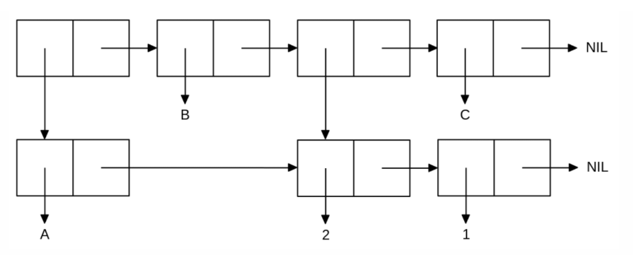

<p align="center"><b>МОНУ НТУУ КПІ ім. Ігоря Сікорського ФПМ СПіСКС</b></p>
<p align="center">
<b>Звіт з лабораторної роботи 1</b><br/>
"Обробка списків з використанням базових функцій"<br/>
дисципліни "Вступ до функціонального програмування"
</p>
<p align="right">**Студент(-ка)**: *Сурмачевський Владислав Володимирович*<p>
<p align="right">**Рік**: *2024*<p>
## Загальне завдання 1
  ### Пункт 1
    Створіть список з п'яти елементів, використовуючи функції LIST і CONS . Форма створення списку має бути одна — використання SET чи SETQ (або інших допоміжних форм) для збереження проміжних значень не допускається. Загальна кількість       елементів (включно з підсписками та їх елементами) не має перевищувати 10-12 шт. (дуже великий список робити не потрібно). Збережіть створений список у якусь змінну з SET або SETQ . Список має містити (напряму або у підсписках):
    хоча б один символ
    хоча б одне число
    хоча б один не пустий підсписок
    хоча б один пустий підсписок
      Код:
      ;; Пункт 1
      (setq my-list (list 'X 42 (list 'A 'B) () (list 1 2)))
      Результат - (X 42 (A B) NIL (1 2))
  ### Пункт 2 - 5 базові операції зі списком
    Отримайте голову списку.
      Код:
      ;; Пункт 2 - голова списку
      (car my-list)
      Результат - X
      

<!--лістинг пунктів загального завдання можна навести в одному блоці коду із коментарями,
які позначають початок виконання окремих пунктів, або ж розділити весь лістинг на окремі
блоки коду і додати для них підзаголовки (напр. ### Пункт 1)-->
```lisp
<тут має бути лістинг (текст) виконання загального завдання>
```
## Варіант <номер варіанту>
<p align="center">

</p>
```lisp
<тут має бути лістинг (текст) виконання завдання за варіантом>
